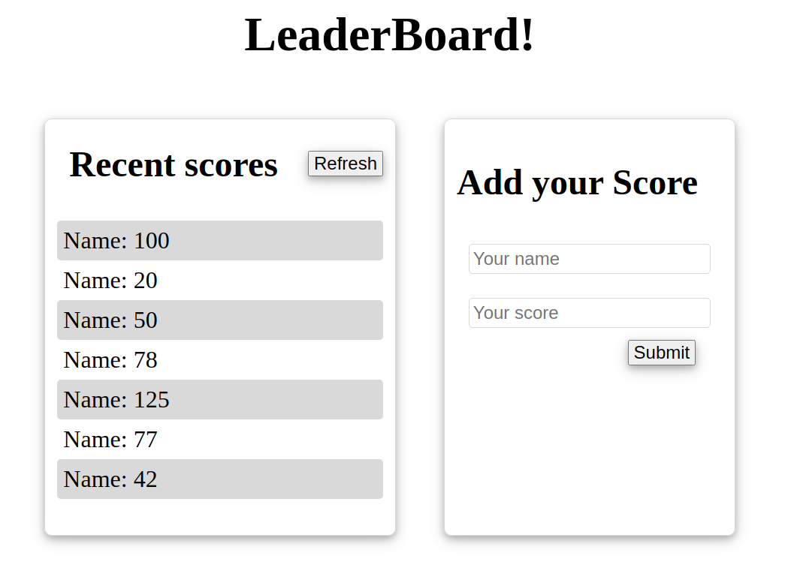

# LeaderBoard-List-App
The leaderboard website displays scores submitted by different players. It also allows you to submit your score. All data is preserved thanks to the external Leaderboard API service.

features:
- Display recent scores
- Enter your name and scores

## Built With

- Javascript
- Webpack
- Html/CSS

## Live Demo

Site still under development

## Getting Started

### Prerequisites

- node.js
- Javascript
- Git and Github
- Terminal
- browser

### Setup

- clone the following repo link, git@github.com:Mihndim2020/LeaderBoard-List-App.git
- cd into the directory and run npm install to install dependencies
- run npm run build
- run npm start

### Usage

- run index.html in your favorite browser to display the interface.

## Author

👤 **Mih Julius Ndim **

- Github: [@Mihndim2020](https://github.com/Mihndim2020)
- Twitter: [@mihndim](https://github.com/mih-julius) 
- Linkedin: [Mih Julius](https://www.linkedin.com/mih-julius)

## Show your support

Give a ⭐️ if you like this project!

## Acknowledgments

- Hat tip to anyone whose code was used
- Inspiration
- etc

## 📝 License

This project is [MIT](./LICENSE) licensed.
